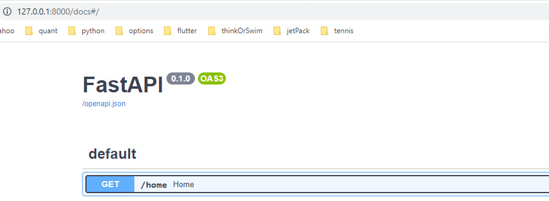
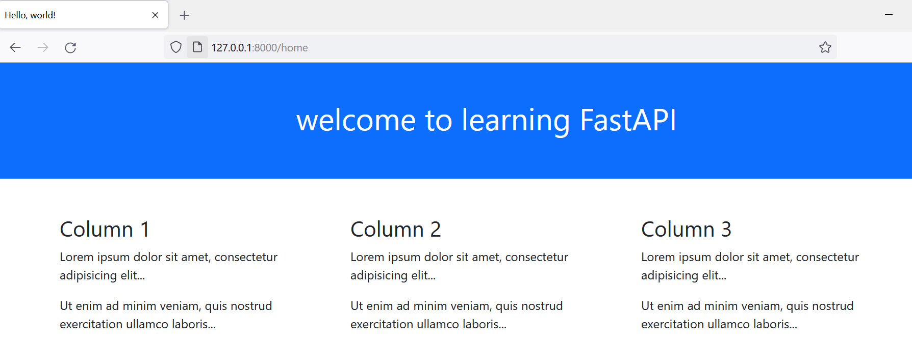
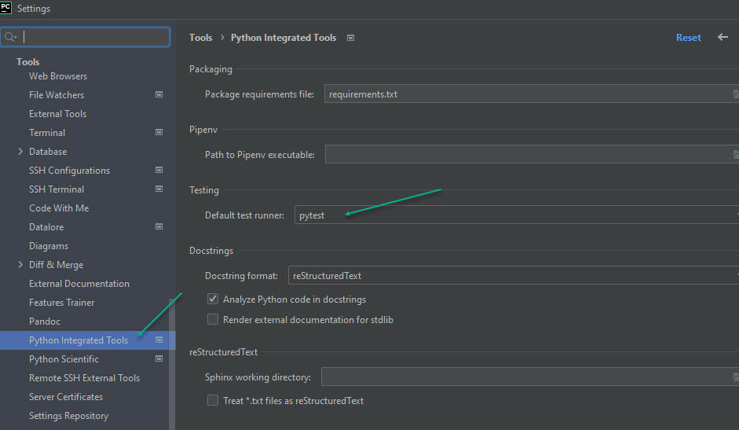

# How to divide the app into logical components
we will put the code into folders

- api : all api go here
- views : all views definitions go here
- templates : all jinja2 templates go here

## main.py
```python
import fastapi
import uvicorn
from views import home

api = fastapi.FastAPI()


def config_routers():
    api.include_router(home.router)


config_routers()

if __name__ == '__main__':
    uvicorn.run(api)
```

## views\home.py
```python
import fastapi
from fastapi.templating import Jinja2Templates
from starlette.requests import Request

home_templates = Jinja2Templates("templates")

router = fastapi.APIRouter()


@router.get("/home")
def home(request: Request):
    return home_templates.TemplateResponse("home.html", {
        "request": request,
        "welcome": "welcome to learning FastAPI",
    })

```
## template
see the repo

## swagger ui
this comes free


## output when run



# Testing
we will use pytest


## add a pytest module
create a dir called tests
create a file in there test_home.py
```python
from fastapi.testclient import TestClient
from main import api

client = TestClient(api)

def test_valid_id():
    response = client.get("/home")
    assert response.status_code == 200
    assert response.json() == {"fruit": "apple"}
```
now right click and run the pytest


## enable pytest in pycharm


[click here to jump to readme](../README.md)
