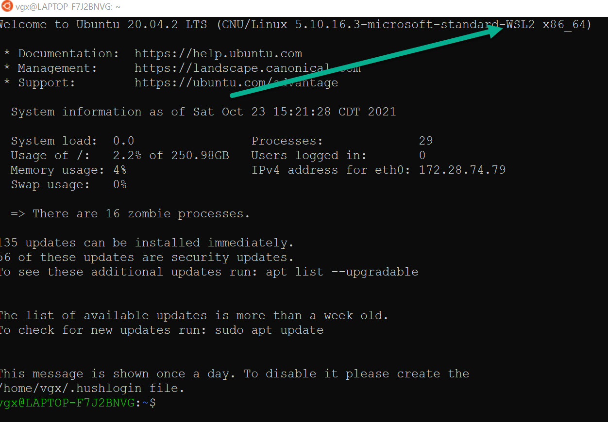
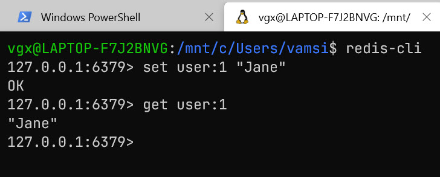

# How to install redis on windows 10 WSL
I already have wsl2 and ubuntu installed on the laptop



## first update to WSL2
first tupdate to WSL 2

	https://www.omgubuntu.co.uk/how-to-install-wsl2-on-windows-10
	    Installed Ubuntu on WSL
	    created user vgx/<pwd>
	>sudo apt-get update
	>sudo apt install build-essential 

## apt-get the redis binaries
    https://developer.redis.com/create/windows/
## run the redis service
```shell
vgx@LAPTOP-F7J2BNVG:~$  sudo service redis-server restart
Stopping redis-server: redis-server.
Starting redis-server: redis-server.
```
## SSH into Ubuntu from windows terminal


# Test redis from python code
run via pytest
```python
import redis

def test_valid_id():
    r = redis.StrictRedis('localhost', 6379, encoding="utf-8", decode_responses=True)
    r.mset({'Croatia': 'Zagreb', 'Bahamas': 'Nassau'})
    assert r.get('Bahamas') == 'Nassau'

```


