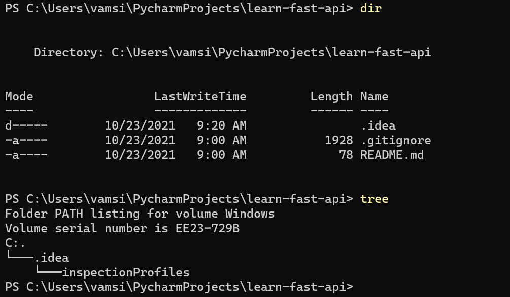
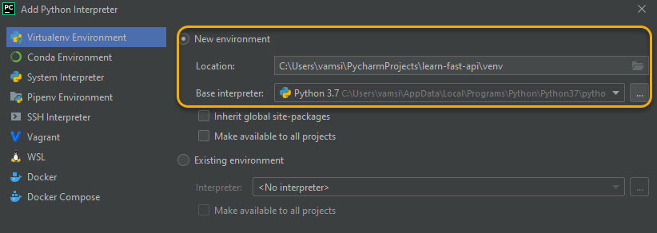
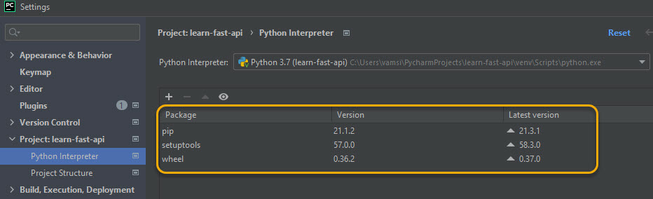
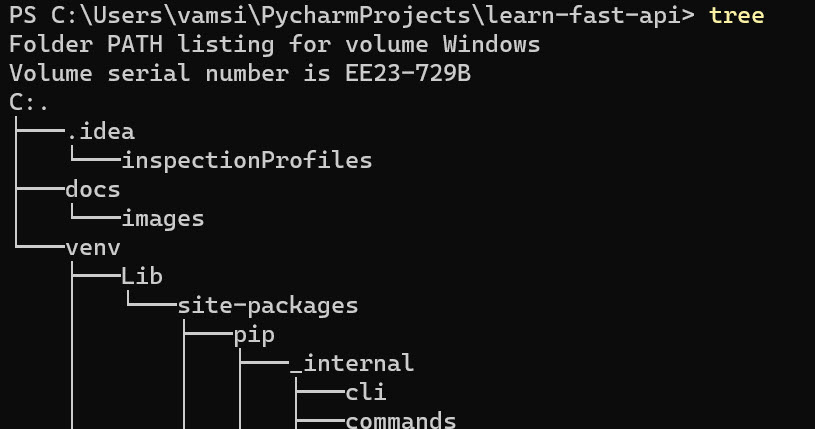
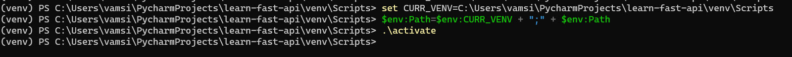
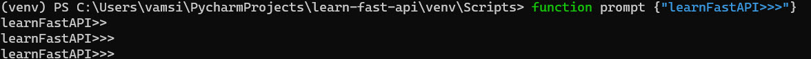
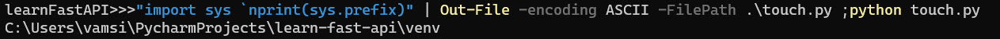

# set up the project
Intialize a project on a git repo with just readme



# tools used
My tools set up is
* Windows 10

* PyCharm 2021.x
    - python version 3.7
    - venv
  

### which venv ?
The project structure is configured to use a local venv as follows


the default pkgs that appear


#### test it out
open terminal and cd to `C:\Users\vamsi\PycharmProjects\learn-fast-api`
looks like this


run commands to touch the venv
```bat
set CURR_VENV=C:\Users\vamsi\PycharmProjects\learn-fast-api\venv\Scripts^C
(venv) PS C:\Users\vamsi\PycharmProjects\learn-fast-api\venv\Scripts> set CURR_VENV=C:\Users\vamsi\PycharmProjects\learn-fast-api\venv\Scripts
(venv) PS C:\Users\vamsi\PycharmProjects\learn-fast-api\venv\Scripts> $env:Path=$env:CURR_VENV + ";" + $env:Path
(venv) PS C:\Users\vamsi\PycharmProjects\learn-fast-api\venv\Scripts> .\activate
```


change the prompt


verify venv using powershell



# Setup httpie
The python native http tool similar to `curl` or `httprepl`
see the docs at  https://httpie.io/docs#installation

run `>https httpie.io/hello`

# Create first helloWorld rest endpoint
## add requirements
* create a file requirements.txt with contents
  ```text
    fastapi
    uvicorn
  ```

pyCharm will prompt for install of the dependencies

add the main.py (see the github repo or watch the video mentioned in the credits section)
```python
import fastapi
import uvicorn

api = fastapi.FastAPI()


@api.get("/")
def home():
    return {
        "msg": "Hello world",
    }


uvicorn.run(api)

```

result

```cmd
learnFastAPI>>>http localhost:8000
HTTP/1.1 200 OK
content-length: 21
content-type: application/json
date: Sat, 23 Oct 2021 16:29:10 GMT
server: uvicorn

{
    "msg": "Hello world"
}

```

[click here to jump to readme](../README.md)
